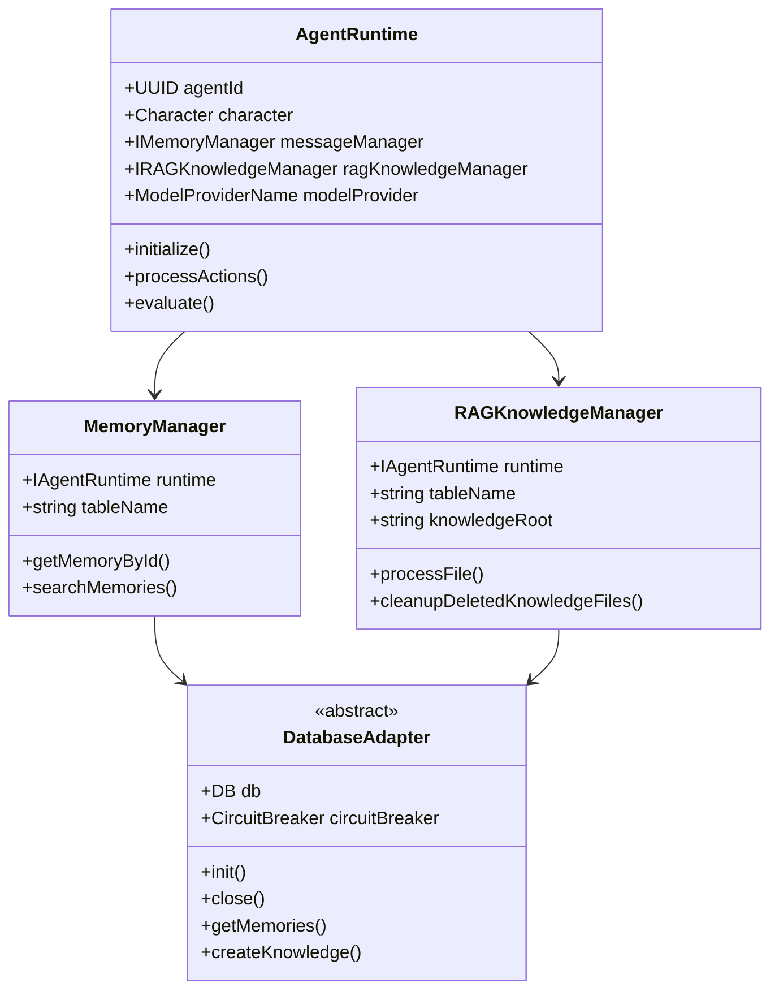
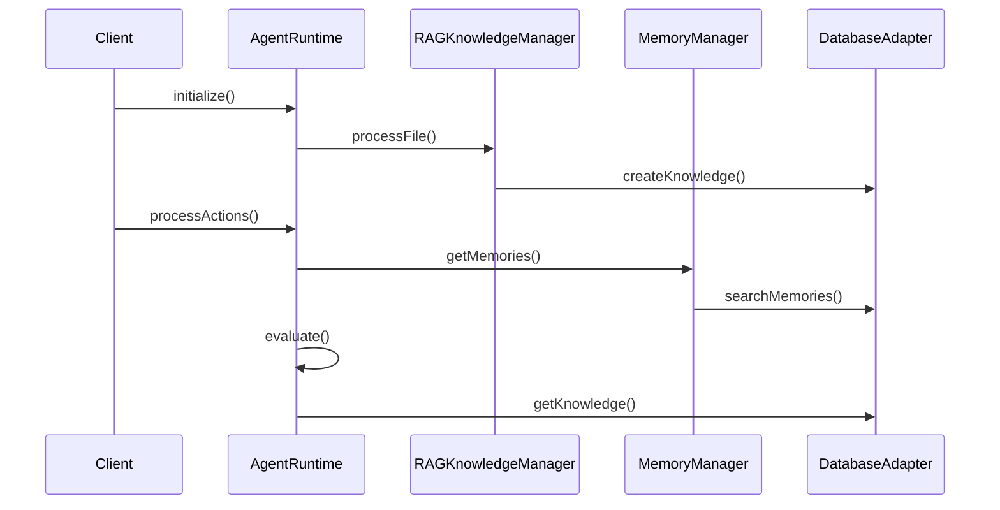

# Project Analysis: ElizaOS Core Package

## 1. Project Overview

This appears to be a core package for ElizaOS, a system that seems to handle AI agent interactions, memory management, and knowledge processing. The project is written in TypeScript and uses modern ES modules.

## 2. Directory Structure

```bash
packages/core/
├── src/
│   ├── database/
│   │   └── CircuitBreaker.ts
│   ├── models.ts
│   ├── runtime.ts
│   ├── database.ts
│   ├── ragknowledge.ts
│   ├── memory.ts
│   ├── localembeddingManager.ts
│   ├── cache.ts
│   ├── types.ts
│   ├── config.ts
│   └── test_resources/
│       └── testSetup.ts
├── vitest.config.ts
├── tsup.config.ts
├── nodemon.json
├── package.json
└── README-TESTS.md
```


## 3. Core Components Analysis
    Key responsibilities:
    - Manages agent state and configuration
    - Handles message processing
    - Coordinates between different services
    - Manages knowledge and memory systems

## 4.UML Class Diagram


## 5. Configuration System

The project uses multiple configuration layers:
- Environment variables (via dotenv)
- Runtime configuration
- Model configuration

Configuration files:

```1:9:src/config.ts
import dotenv from "dotenv";
import path from "path";
import { fileURLToPath } from "url";

const __filename = fileURLToPath(import.meta.url);
const __dirname = path.dirname(__filename);

// Load environment variables from root .env file
dotenv.config({ path: path.resolve(__dirname, "../../../.env") });
```

## 6. Execution Flow Diagram



This documentation provides a high-level overview of the system's architecture and key components. The project appears to be a sophisticated AI agent system with robust memory management, knowledge processing, and database abstraction layers.

